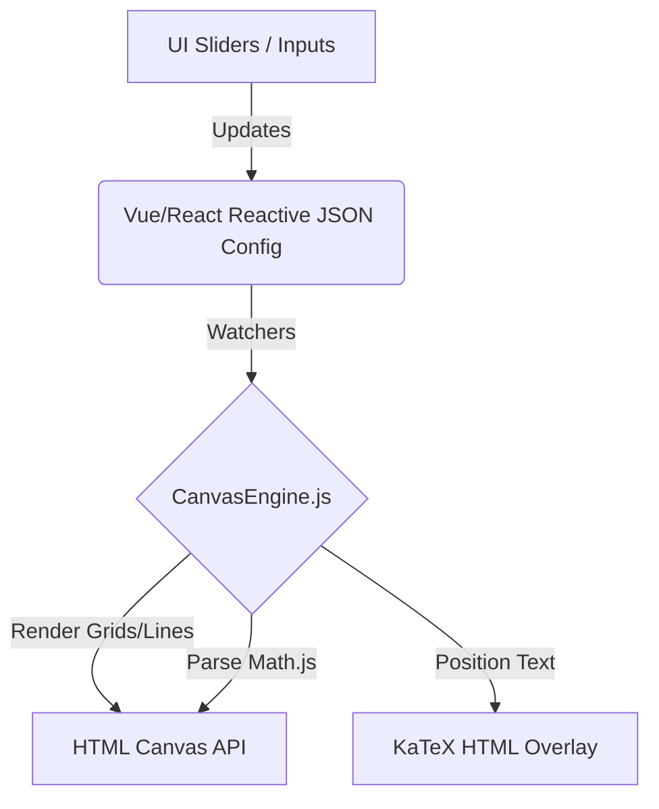

# Frontend Interface Plan: Python Mathematical Graph Engine

## 1. Feature Analysis & Configuration Extraction
Based on the underlying `graph_engine.py` and the various test cases (`test_graph_sinus.py`, `test_graph_diffeq.py`, etc.), the UI needs to abstract the following parameters into a declarative JSON configuration:

### A. Canvas & Viewport Config
- **Canvas Dimensions**: Width and Height (e.g., 720x405 for standard 16:9 widescreen presentation) and Font Family.
- **Viewport Mathematics**: 
  - Bounds: `x_min`, `x_max`, `y_min`, `y_max`.
  - Margins: `top`, `bottom`, `left`, `right`.
  - Grid Support: Number of viewports (rows/cols) and gap offsets for complex layered/stacked graphs.

### B. Axes & Grid Lines Layer
- **Grid Lines**: Toggle visibility, custom step intervals (`x_step`, `y_step`).
- **Axes Styling**: Toggle main axes arrows, stroke widths.
- **Ticks & Labels**: Explicit vs automatic tick generation, formatting settings (e.g., Dutch comma decimals), and explicit axis title locations (`x_label`, `y_label`).

### C. Graphing Elements & Layers
- **Mathematical Functions**: Expression strings (e.g., `0.16 * sin(pi * t)`), line color, stroke width, and dash patterns.
- **Hatch Areas**: Definitions for `top_function` and `bottom_function`, x-limits, hatch density (step PT), and stroke color.
- **Parametric / Differential Equations**: System of differential equations (e.g., Lorenz attractor `dx/dt`, `dy/dt`, `dz/dt`), initial conditions, timestep (`dt`), and step count.
- **Piecewise Paths**: Direct array configurations of `(x, y)` coordinate segments.

### D. Annotations & Aesthetics
- **Points**: `(x, y)` math position, marker radius, fill color, text label, and positional label offset.
- **Lines/Arrows**: Tangent lines, stealth arrows, and double-headed phase arrows defined by coordinate pairs.
- **Legends**: Position, bounding box styling, and item lists pairing text labels with color swatches.
- **Text & LaTeX**: Raw strings or complex LaTeX formulas with math coordinates, font size, color, alignment, and background masking properties.

---

## 2. UI/UX Architecture & Presets System

### Layout Structure
The application should be built as a Single Page Application (SPA) using **Vue.js** (or React) paired with **Tailwind CSS**. The interface divides cleanly into:
- **Left Sidebar (Configurator)**: A scrollable panel containing accordions for all settings grouped logically (Canvas, Viewport, Layers, Annotations).
- **Main View (Live Preview)**: A dominant HTML `<canvas>` element surrounded by a presentation-slide-styled border, rendering the exact layout in real-time.
- **Top Navbar (Actions)**: Presets dropdown, Export status, and the "Convert to Presentation" button block.

### The Presets System
A robust initialization mechanism where picking from a dropdown entirely replaces the active Configuration JSON with standard templates based on the test files:
1. **Sinusoidal Wave (Physics)**: Sine wave, colored tangent lines, P/Q/R/S crossover points.
2. **Area Between Curves**: Intersecting parabolas highlighting bounded hatched regions.
3. **Phase Diagram**: Horizontal phase double-arrows with vertical drop bounds.
4. **Differential Equation**: 3D projection of a Lorenz attractor with heavy LaTeX notation.
5. **Multi-Grid Layout**: 4 isolated viewports arranged in a 2x2 grid.

---

## 3. Live Preview System (HTML Canvas Sync)

To satisfy the requirement of *rendering the graph logic directly in the browser via Canvas/JS for instant feedback*:

### Client-Side Engine Re-implementation (`CanvasEngine.js`)
The JS frontend will replicate the core math and viewport transformations of `graph_engine.py` to prevent network latency during edits:
- **Viewport Mapping**: The UI will natively execute the `map_x()` and `map_y()` formulas to convert mathematical coordinates to screen-space coordinates.
- **Math Evaluation**: String expressions are parsed using a library like `math.js`. The engine discretizes the path (e.g., 200 points) and issues rapid `ctx.lineTo()` calls.
- **LaTeX Approximation**: Real LaTeX requires backend tools (`pdflatex` + `inkscape`). For 60fps Live Preview, LaTeX strings will be rendered as absolutely positioned HTML overlays using **MathJax** or **KaTeX** hovering perfectly over the corresponding canvas coordinates.

### Architecture Flow


---

## 4. Google Slides Integration Flow (Backend Python)

While the frontend provides the instant preview, the backend serves as the absolute source of truth for generating native Google Slides elements.

### Export to Presentation
1. User clicks **"Convert to Presentation"**.
2. Frontend sends `POST /api/export` with the declarative `JSON Configuration`.
3. A backend FastAPI server receives this, initializes `AtomicDiagramGenerator`, evaluates the math via Python, compiles true LaTeX into PNGs via Inkscape, and produces the flat elements JSON.
4. Calls `gslides_uploader.py` to create a new presentation.
5. Returns `presentation_id` to the frontend.

### Appending to Existing Presentations (New Capability)
To fulfill the requirement of not creating a new file on every save:
1. Upon successful export, the UI retains the `presentation_id`.
2. The export button text transforms into **"Append to Presentation"**.
3. Upon clicking, the frontend hits `POST /api/append_slide`.
4. The backend must be updated. In `gslides_uploader.py`:

```python
def append_slide_from_canvas_data(self, presentation_id, canvas_data):
    # 1. Create a new blank slide at the end of the deck
    slide_id = f"slide_{uuid4().hex}"
    create_req = [{'createSlide': {'objectId': slide_id}}]
    self.slides_service.presentations().batchUpdate(
        presentationId=presentation_id, body={'requests': create_req}
    ).execute()
    
    # 2. Reuse element generation logic targeting the new slide's pageObjectId
    requests = self._generate_element_requests(slide_id, canvas_data)
    
    # 3. Batch apply drawing requests to the new slide
    self.slides_service.presentations().batchUpdate(
        presentationId=presentation_id, body={'requests': requests}
    ).execute()
```

---

## 5. UI/UX Interaction & Polish
- **Debouncing**: Intensive operations (like looping 1000 times for the Lorenz attractor Live Preview) must be debounced by ~15-30ms when dragging sliders.
- **Aspect Ratio Locking**: The Canvas element must visually scale its CSS size to fit the screen, but maintain its internal coordinate scaling (e.g., `720x405` PT) so WYSIWYG text sizing is exactly preserved.
- **Expandable Layer Accordions**: As graphs get complex, layers should be collapsible and sortable. Hovering over a layer config in the UI should subtly highlight the drawn path on the Canvas for immediate cognitive mapping.