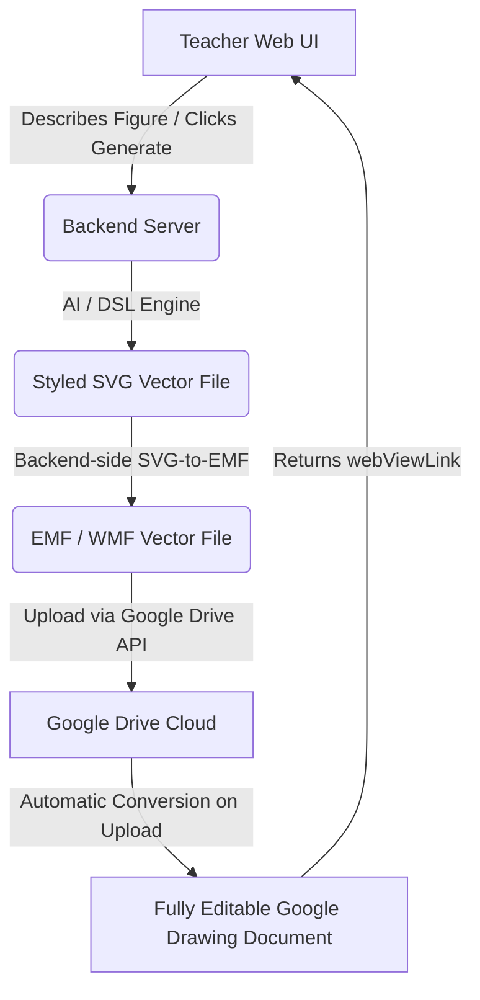
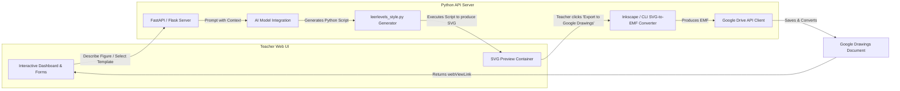

# Leerlevels Figuremaker & Google Drawings Integration Research and Plan

This document presents a comprehensive research summary and an architectural plan to build a **Figuremaker Toolbox** for teachers. It addresses how to programmatically generate and edit figures in the Leerlevels style while ensuring they remain fully editable within Google Drawings.

---

## 1. Architectural Blueprint: Google Drawings Programmatic Pipeline

### The Challenge
Standalone Google Drawings do not have a dedicated REST API for document-element manipulation (unlike Google Slides, which has a structured API with `batchUpdate` shapes). Furthermore, local `.gdraw` files are merely lightweight JSON files containing Google Drive links and file IDs, rather than local vector information. 

### The Solution: Server-Side SVG-to-EMF Conversion and Google Drive Import
The most reliable, industry-proven workaround to programmatically create and edit native Google Drawings is using the **Google Drive API's vector-conversion import pipeline**.

Since this is a web-based tool for teachers, **the teacher needs zero local dependencies** (no Inkscape, no LibreOffice, no Python). Everything is processed on the web server (backend) and accessed via a standard browser.

#### Detailed Execution Steps:
1. **Vector Drawing Generation**: Python script generates the figure as a high-fidelity SVG (using a custom styled library like `matplotlib` or a custom `leerlevels-svg` generator).
2. **Backend-Side Format Conversion (SVG to EMF)**: Convert the SVG to EMF (Enhanced Metafile).
   - *Production Environment*: The web server has `inkscape` or `libreoffice` installed (e.g., inside a Docker container) and performs headless conversion via Python `subprocess`. This is 100% free, fast, and highly accurate.
   - *Development Environment*: We can install Inkscape/LibreOffice on our development machine or use a Python-native alternative for testing.
3. **Google Drive Upload & Conversion**: Upload the EMF file to Google Drive using the `google-api-python-client`. By setting the target `mimeType` in metadata, Google Drive automatically converts the vector graphic into a native, fully-editable Google Drawing document:
   - **File Metadata `mimeType`**: `application/vnd.google-apps.drawing`
   - **Upload Media `mimetype`**: `application/x-msmetafile`
4. **Interactive Editing**: The API returns a `webViewLink` (or file ID) allowing teachers to open the document and immediately double-click, drag, ungroup, resize, edit text, or recolor elements exactly as they are used to in Google Drawings.
5. **Fidelity Sync**: For previewing, the backend can fetch the public SVG or PNG export of that Drawing via `/export/svg` or `/export/png` endpoints.

---

## 2. Target Style Analysis: Leerlevels Figuring System

In **Code Mode**, we will programmatically download and decode the target Google Drawing link:
`https://docs.google.com/drawings/d/1eSvF7_ekvOWy1q0npqI8f37J9IARPBOZJte5Q3pDspw/edit`

### Objective Style Guidelines to Extract:
To build a consistent style definition, we will extract:
- **Palette**: Exact HEX codes for primary, secondary, highlight, and background/boundary colors.
- **Typography**: Specific Google Fonts (e.g., Arial, Roboto, Open Sans) and standard sizing hierarchy for axes, titles, and annotations.
- **Line Graphs & Error Regions**: Rules for line thickness, dashed lines for auxiliary/extrapolation curves, and semi-transparent shading for error ranges or areas under the curve.
- **Simplification Rules**: Guidelines on how real-world items (pulleys, test tubes, coordinate grids) are simplified into clean vector icons.

---

## 3. AI Code-Generation & Prompting Strategy

Instead of training an LLM to generate complex EMF binaries or raw, low-level SVG XML directly (which often results in formatting errors or malformed structures), we will adopt a **High-Level Python DSL (Domain-Specific Language) Strategy**:

1. **Lightweight Python Helper Library (`leerlevels_style.py`)**:
   We will write a library that defines common primitives pre-styled in the Leerlevels design language:
   - `create_canvas(width, height)`
   - `draw_coordinate_system(x_range, y_range, label_x, label_y)`
   - `plot_line(formula, color, style='solid', stroke_width=2)`
   - `add_error_shading(formula, error_margin, color)`
   - `draw_arrow(start_coord, end_coord, arrow_style)`
   - `add_text_annotation(coord, text, font_size, alignment)`
   - `draw_physics_block(coord, width, height, force_vectors)`

2. **LLM Prompting**:
   The LLM is prompted to output **pure, high-level Python code** utilizing `leerlevels_style.py`. 
   - *Advantages*:
     - Output length is drastically reduced (no repetitive SVG XML boilerplate).
     - Primitives are guaranteed to match the exact Leerlevels style (colors, line weights, arrow shapes) automatically.
     - The code can be sandboxed, validated, and run locally to generate the final SVG/EMF.

---

## 4. Web-Based Teacher Toolbox Architecture

### Proposed Interface Features:
- **Templates Directory**: Pre-configured categories like Graphs, Chemistry Apparatus, Physics Vectors, Mathematics Geometry, and Simplifications.
- **Live Form Editing & Natural Language Support**: Allow teachers to tweak values (e.g., change slope, move point, edit labels) or enter chat instructions (e.g., "Add an error-bar at x=5").
- **Google Authentication Integration**: Teachers log in using Google Single Sign-On (SSO) so that files are created directly inside their personal/school Google Drive accounts.

---

## 5. Proposed Implementation Tasks

We propose breaking the development down into the following sprints:

### Sprint A: Proof of Concept & Conversion Pipeline
- [ ] Connect with the Google Drive API and authorize a test account.
- [ ] Fetch the SVG export of the target Google Drawing (`1eSvF7...`) and decode its styles.
- [ ] Implement a Python test script that converts a simple SVG to EMF (using subprocess with a headless converter).
- [ ] Upload the EMF to Google Drive with Google Drawings target MIME Type, verifying that it is fully editable.

### Sprint B: Objective Style Definition & DSL Library
- [ ] Create `leerlevels_style.py` with standard style specs (color palette, fonts, grids, stroke styles).
- [ ] Implement basic primitives: Axes, line-plots, coordinate systems, and physics force vectors.
- [ ] Build a test suite of several figure examples matching the existing Leerlevels gdraw files.

### Sprint C: Web Application & AI Integration
- [ ] Build a lightweight backend (FastAPI/Flask) to execute python drawing scripts and serve preview SVGs.
- [ ] Develop the prompt engineering strategy for LLM to write scripts using `leerlevels_style.py`.
- [ ] Create the frontend user interface for teachers with templates, prompts, live preview, and a "Save to Google Drawings" button.
- [ ] Add Google OAuth to save Drawings directly to the teacher's Google Drive.
