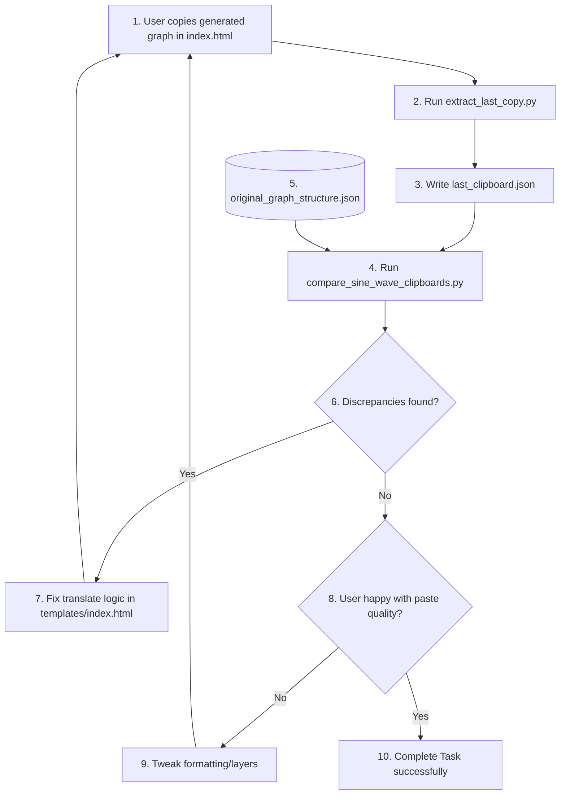

# Step Plan: High-Fidelity Sine Wave Clipboard Comparison & Resolution

This step plan details the systematic process we will follow to eliminate discrepancies between the generated clipboard output (from [`templates/index.html`](templates/index.html)) and the reference baseline (`clipboard_iterations/test_sine_wave`).

## Core Objectives
*   **Exact Matching:** Ensure every graphical property, coordinate scaling, transformation matrix, style tuple, character insertion, font styling, and Z-index layout matches the reference exactly, ignoring only dynamic elements (like `objectId`s, session tokens, and cryptographic keys).
*   **No Laziness / Thorough Iteration:** Compare layer-by-layer (gridlines, axes, text labels, curve segments, points, LaTeX blocks) and work through corrections methodically.
*   **User Validation:** Run a local extraction script on the user's active clipboard, run an automated comparison tool, and show the progress transparently before asking the user to copy again and re-test.

---

## Systematic Step-by-Step Plan

### Phase 1: Clipboard Capture & Automated Differential Analysis
1.  **Extract Current Clipboard:**
    *   Switch to **Code Mode** to execute CLI operations.
    *   Execute `python extract_last_copy.py` to lock, read, and decode the current system clipboard (filled by the user's copy action on `index.html`), saving it to `last_clipboard.json`.
2.  **Develop Automated Diffing Utility:**
    *   Create a robust comparison script `compare_sine_wave_clipboards.py`.
    *   This script will:
        *   Load `last_clipboard.json` and the reference file `clipboard_iterations/test_sine_wave/original_graph_structure.json`.
        *   Isolate the inner GWT payloads under the `"data"` field (which contains `resolved`, `unresolved`, and `autotext_content`).
        *   Discard dynamic IDs (by mapping `objectId`s to normalized order-based indices, e.g., `axes_child_0` -> `child_0`, etc.).
        *   Group elements by category: rectangles (`shapeTypeId 6`), ellipses (`shapeTypeId 8`), line paths/connectors (`shapeTypeId 153`), text boxes (`shapeTypeId 108`), text insertions (`op 15`), and formatting applications (`op 17`).
        *   Perform a field-by-field, array-by-array comparison of:
            *   **Transform matrices:** `[scaleX, skewX, skewY, scaleY, tx, ty]`
            *   **Styling tuples:** Compare key-value pairs (e.g., solid fill flags, stroke outline colors, line thicknesses, dash styles, and arrowheads).
            *   **Text content and properties:** Check text alignments, bold/italic, font size, and font family mappings.
            *   **Autotext mappings:** Verify the keys in `autotext_content` correspond perfectly.
        *   Generate a highly detailed console output showing exact additions, deletions, or value mismatches.

### Phase 2: Layer-by-Layer Verification & Corrections
Using the automated analysis report, we will fix issues in `templates/index.html`'s `convertToGoogleSlidesJSON` function layer-by-layer:

*   **Layer 0 (Gridlines & Borders):**
    *   Verify coordinates/tx/ty offsets for intermediate vertical and horizontal lines.
    *   Check stroke thickness (`508` vs `1524` centipoints) and dash style states (`43, 2` for dashed, `43, 0` for solid border lines).
*   **Layer 1 (Plotted Math Curves & Vertical Markers):**
    *   Verify the mathematical path scale properties and precision.
    *   Ensure custom line styles match the reference.
*   **Layer 2 (LaTeX Formula Blocks & Backgrounds):**
    *   Verify background rectangular masks and opacity styling.
    *   Verify LaTeX image scale properties.
*   **Layer 3 (Axes / Ticks / Arrowheads):**
    *   Confirm axis scale metrics and tick positioning.
    *   Check arrowhead styling properties (keys `27`, `28`, `29`, `30`).
*   **Layer 4 (Text Axis Labels & Titles):**
    *   Verify text alignments (`alignVal` mappings 1, 2, 3).
    *   Verify exact font sizes, styles, colors, and vertical boundaries.

### Phase 3: Iterative Testing Loop
For each layer of corrections:
1.  Apply the target fixes to the `templates/index.html` translation code.
2.  Have the user refresh the web page, generate/copy the sine wave graph.
3.  Execute `python extract_last_copy.py` to capture their new clipboard.
4.  Run `compare_sine_wave_clipboards.py` to identify remaining mismatches.
5.  Proceed only when the current layer matches the reference structure 100%.

---

## High-Level Workflow Architecture

